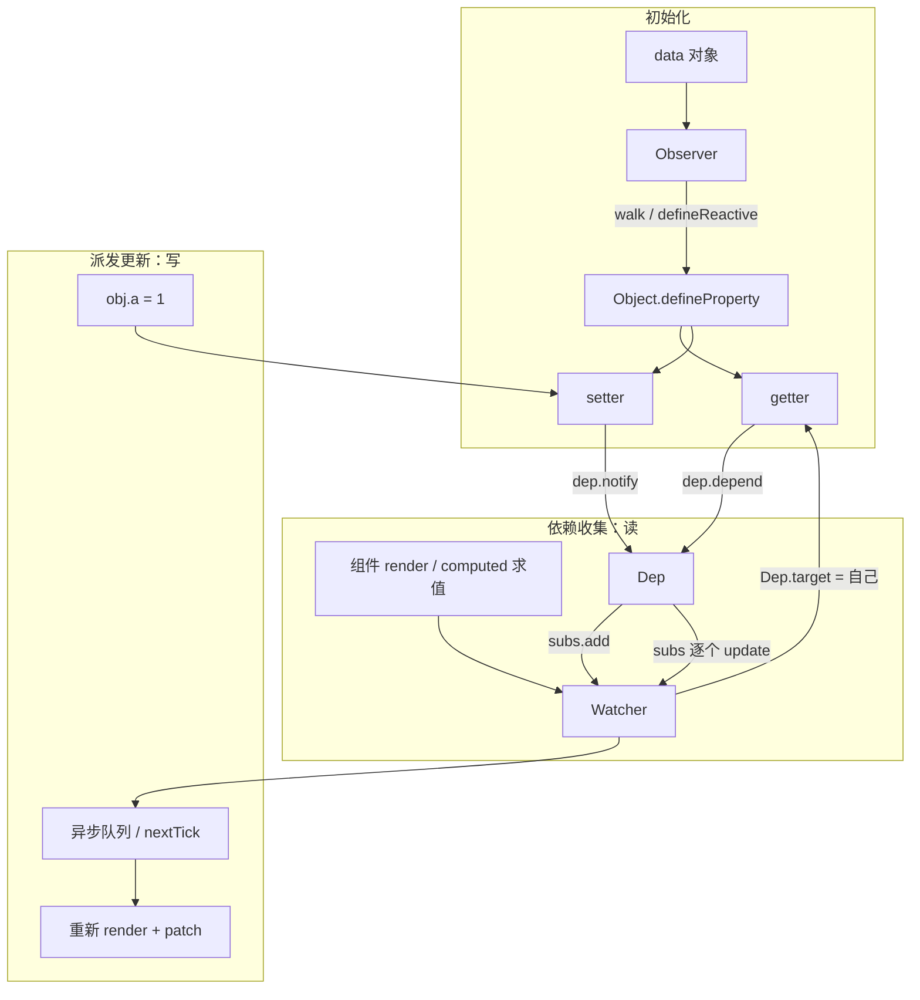
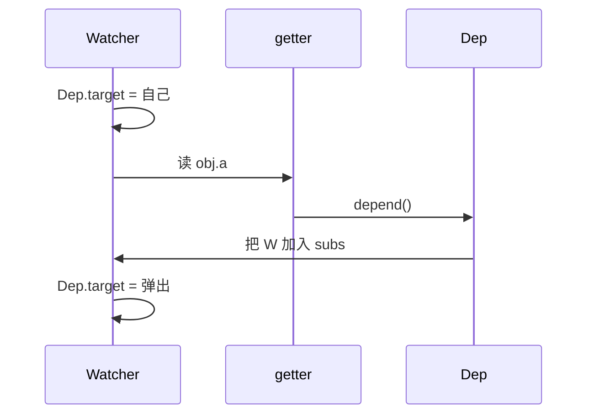
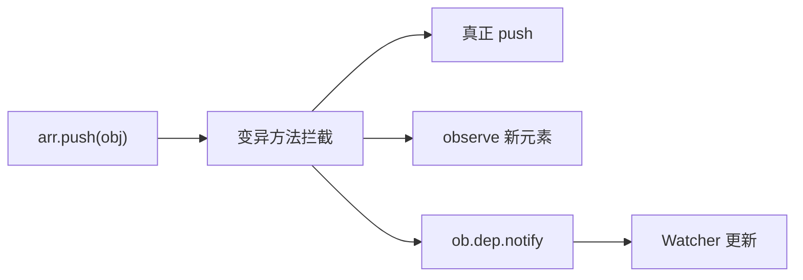

# Vue 2 响应式原理（25k 一面）

## 一面口述（机制链，约 90 秒）

初始化：`initState` 里对 `data` 调 `observe`，给对象挂 Observer（`__ob__`）。普通对象 `walk` 每个已有 key 走 `defineReactive`，用 `Object.defineProperty` 劫持；**每个 key 闭包一个 Dep**。数组不劫持下标，把 `__proto__` 指到改过的 `arrayMethods`（7 个变异方法）。

收集：组件 mount 会 new 一个**渲染 Watcher**。它 `get()` 时把自身放到全局 `Dep.target`，再执行 `render`。render 读到哪个响应式字段，就进那个字段的 getter，getter 里 `dep.depend()`：有 `Dep.target` 就把当前 Watcher 推进这个 Dep 的 `subs`。求值结束弹出 `Dep.target`。所以依赖是 **「这次 render 实际读了哪些字段」动态收集的**，不是静态扫模板。computed 嵌套求值用的是 `Dep.target` 栈，外层渲染 Watcher 还在，里层 computed 先当 target。

通知：赋值走 setter —— 改值，新值是对象再 `observe`，然后 `dep.notify()`，`subs` 里每个 Watcher `update()`。渲染 Watcher **不同步重渲染**，`queueWatcher` 按 id 去重进队列，`nextTick` flush 后再 render + patch。同一轮里改 10 次同一个字段，视图只刷一次。

局限要主动说：`defineProperty` 只能劫持**已经定义的 key**，`obj.b = 1`、`delete obj.a` 进不了 getter/setter。`Vue.set` 补两步：新 key 走一遍 `defineReactive`，再 `__ob__.dep.notify()`（让已经依赖这个对象的 Watcher 更新）。数组 `arr[i] = x`、改 `length` 同样拦不住；`push` 等是包装过的：原生操作 → `observeArray` 新元素 → `ob.dep.notify()`。

面试官还在听就补一句和 Vue 3 的差：Proxy 能拦新属性、删除、下标；Vue 2 初始化就要 walk 所有 key，Vue 3 是读到才深层代理。

---


## 总览图



一句话：读 → Watcher 登记到这个属性的 Dep；写 → Dep 叫醒所有 Watcher。

---

## Observer、Dep、Watcher 各干什么

| 角色 | 干什么 |
|------|--------|
| Observer | 盯整棵对象树：对象走 `defineReactive`，数组走拦截原型方法，子对象再 `new Observer` |
| Dep | 一个属性（或一个数组）的订阅列表。`depend` 收集，`notify` 通知 |
| Watcher | 具体的「谁在用这份数据」：渲染 Watcher、computed Watcher、用户 watch |

关系不是 1:1：

```text
          ┌── Watcher（组件 A 的 render）
  Dep(a) ─┼── Watcher（某个 computed）
          └── Watcher（某个 $watch）

  Watcher（组件 A）──依赖── Dep(a)、Dep(b)、Dep(list)
```

一个组件模板里用了多个字段，就会订阅多个 Dep。一个热数据被多个组件用，一个 Dep 里就有多个 Watcher。

---

## getter 为什么 `dep.depend()`，setter 为什么 `dep.notify()`

```js
Object.defineProperty(obj, key, {
  get() {
    // 当前正在求值的 Watcher 登记到这个属性上
    dep.depend()
    return val
  },
  set(newVal) {
    val = newVal
    // 孩子也可能是对象，要再 observe
    childOb = observe(newVal)
    dep.notify()
  },
})
```

- **depend**：现在有人在读这个属性，把它记成「我的订阅者」，下次改了才知道通知谁。
- **notify**：值变了，把 `subs` 里每个 Watcher 拉去 `update`（进队列，`nextTick` 再刷）。

不 depend 就变成「改了没人知道要重渲染」；不 notify 就是「改了界面不更新」。

---

## `Dep.target` 是干什么的

全局（其实是栈顶）的 **当前正在执行的 Watcher**。

```text
Watcher.get()
  Dep.target = this
  执行 getter / render   ← 期间所有被读的属性 dep.depend()
  Dep.target = 上一个
```

没有 `Dep.target` 时（普通业务代码里读 `obj.a`），getter 里不收集，避免无关读取也进订阅表。

Vue 2 用栈是因为 computed 求值时可能嵌套：外层渲染 Watcher 还在，里层 computed Watcher 要先当 `Dep.target`。



---

## 为什么 Vue 2 新增对象属性检测不到

`defineProperty` **只能劫持已经定义好的 key**。`obj.newKey = 1` 没有 getter/setter，读不会 depend，写不会 notify。

删除同理：`delete obj.a` 不会走 setter。

```text
data: { a: 1 }     ← 初始化时只给 a 加了劫持
obj.b = 2          ← 漏网，界面不更新
Vue.set(obj, 'b', 2)  ← 手动补劫持 + 通知
```

---

## `Vue.set` 到底补了哪两步

`Vue.set(target, key, val)` / `this.$set`：

1. **补 Observer**：给这个新 key 走一遍 `defineReactive`（值是对象再递归 observe）
2. **通知**：找到这个对象的 `__ob__.dep.notify()`，让已经依赖「这个对象」的 Watcher 更新（数组则走数组自己的 dep）

没有第 1 步：以后改 `obj.b` 仍无 getter/setter。  
没有第 2 步：补了劫持，但这一次赋值界面还不刷新。

---

## 为什么数组不能当普通对象劫持

- 用下标 `arr[0] = x`、改 `arr.length`，多数浏览器里 `defineProperty` 不方便或代价大，Vue 2 **不劫持每个下标**。
- 数组方法是原型上的 `push` / `splice` 等，赋值运算符走不到某个元素的 setter。

所以改成：**改写数组原型上的 7 个变异方法**。

```text
Array.prototype  ← 原生
       ↑
arrayMethods     ← Vue 截的副本：push/pop/shift/unshift/splice/sort/reverse
       ↑
你的响应式数组.__proto__
```

`push` 时：先调原生 `push`，对新插进来的元素 `observeArray`，再 `__ob__.dep.notify()`。



**不会触发视图的：** `arr[i] = x`、`arr.length = 0`。要用 `Vue.set(arr, i, x)`、`splice` 或直接换新数组。

---

## 和 Vue 3 对比（追问常接）

| | Vue 2 | Vue 3 |
|--|--|--|
| API | `defineProperty` | `Proxy` |
| 新属性 / 删属性 | 检测不到，要 `Vue.set` | `Proxy` 拦 `set` / `deleteProperty` |
| 数组下标 | 默认不拦 | 拦 |
| 性能 | 初始化就要 walk 所有 key | 懒代理，读到才深层代理 |

Proxy 无法被 polyfill（引擎 trap，不是普通 JS 能模拟的），所以 Vue 3 放弃 IE。

---

## 追问（对照上面答）

**Observer、Dep、Watcher 分别负责什么？**  
Observer 把数据变可观察；Dep 是每个属性的订阅表；Watcher 是使用方（渲染 / computed / watch）。

**getter 为什么要 `dep.depend()`？**  
把当前 `Dep.target` 记进这个属性的 subs，否则改值不知道通知谁。

**setter 为什么 `dep.notify()`？**  
值变了，通知所有订阅 Watcher 去更新（进异步队列）。

**Dep.target 是干什么的？**  
当前正在求值的 Watcher；depend 时就靠它知道「谁在读」。

**一个组件为什么可能依赖多个 Dep？**  
模板 / render 读了多个响应式字段，每个字段一个 Dep。

**为什么 Vue 2 新增对象属性检测不到？**  
只劫持初始化时已有的 key，新 key 没有 getter/setter。

**为什么数组不能简单按照普通对象处理？**  
下标赋值和 length 拦不住；方法在原型上。改劫持 7 个变异方法。

**Vue.set 到底解决了什么？**  
给新 key 补 `defineReactive`，并 `notify` 一次。

**数组的 push/pop/splice Vue 2 是怎么监听的？**  
数组 `__proto__` 指向拦截过的 `arrayMethods`，方法内部先原生操作，再 observe 新元素，再 `ob.dep.notify()`。
